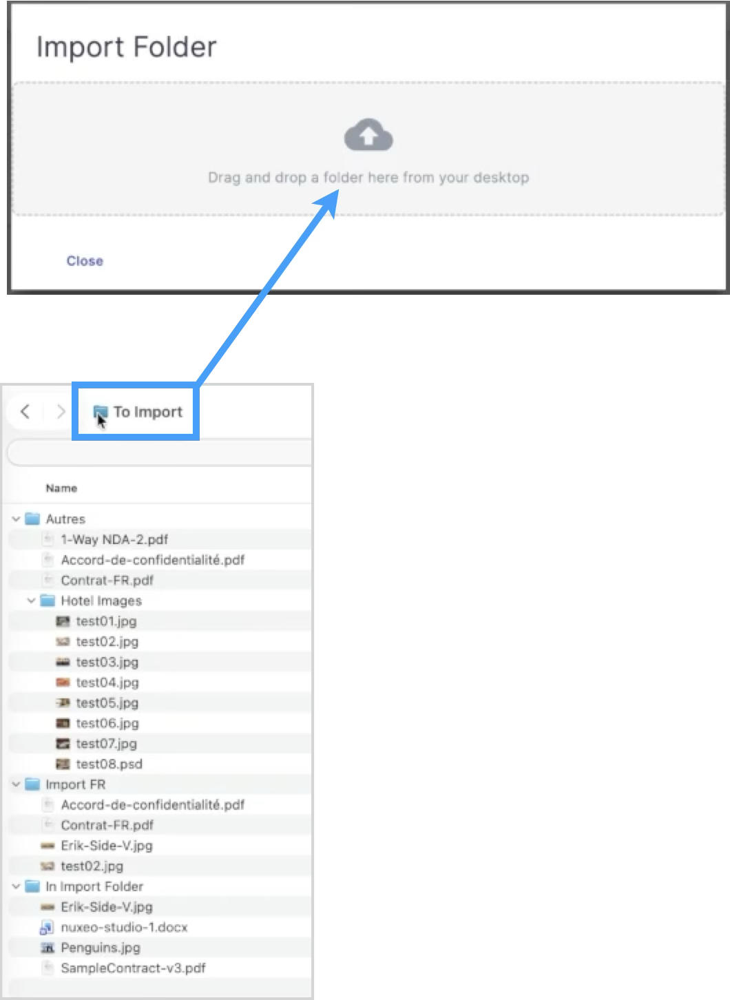
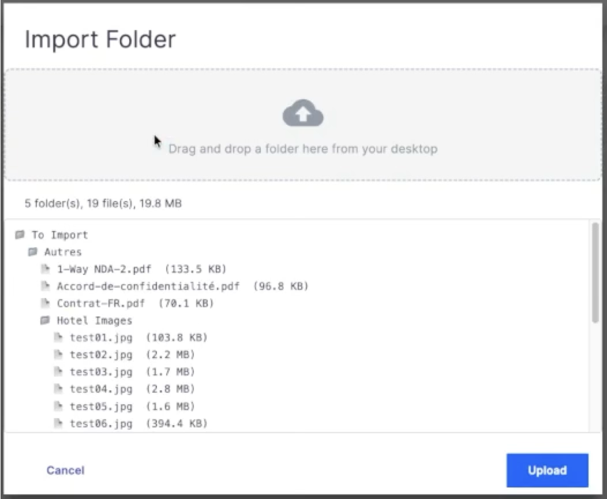
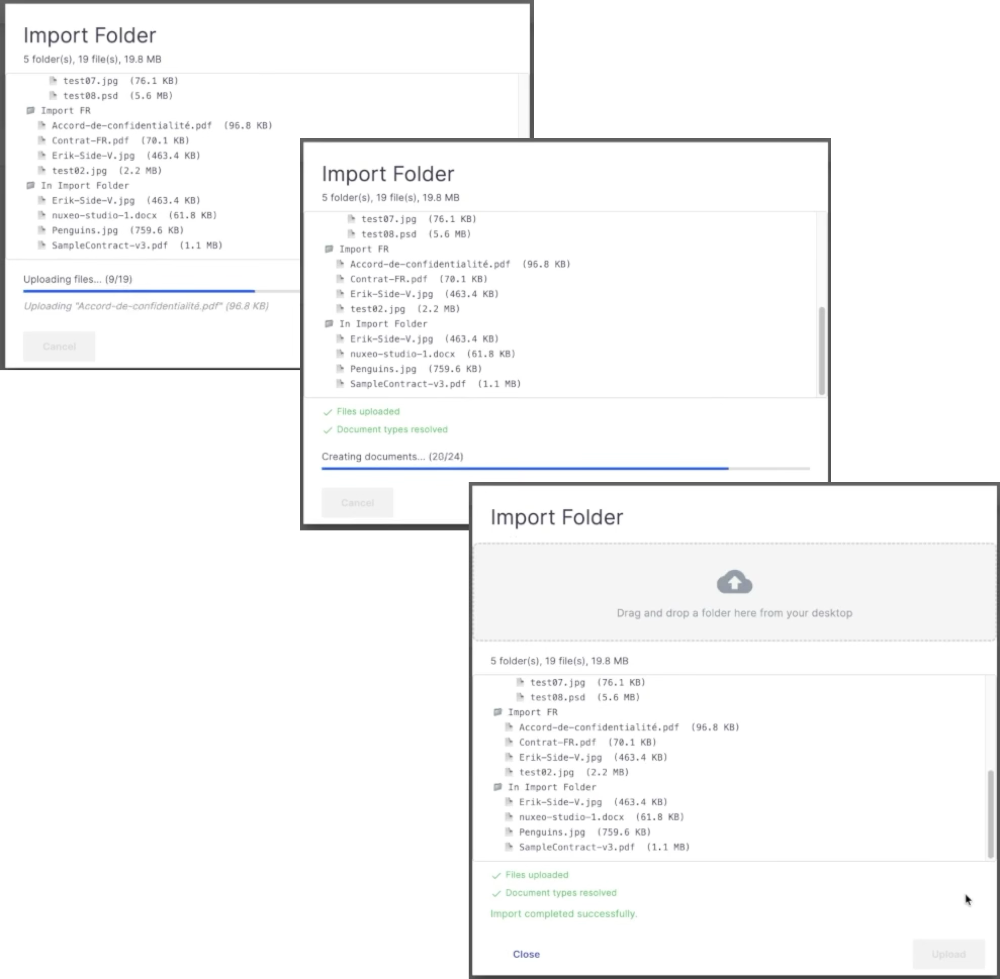
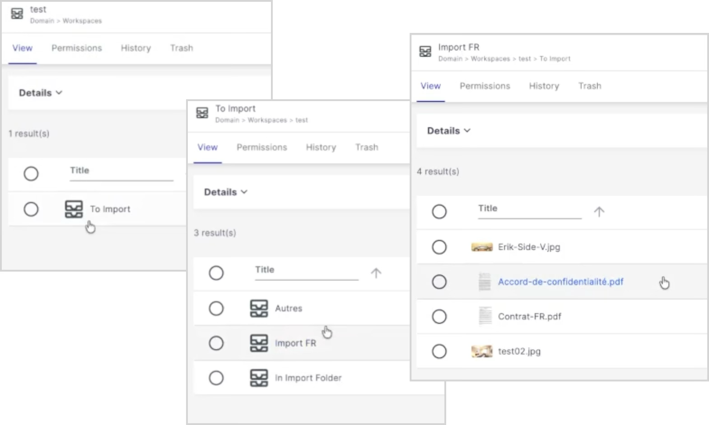
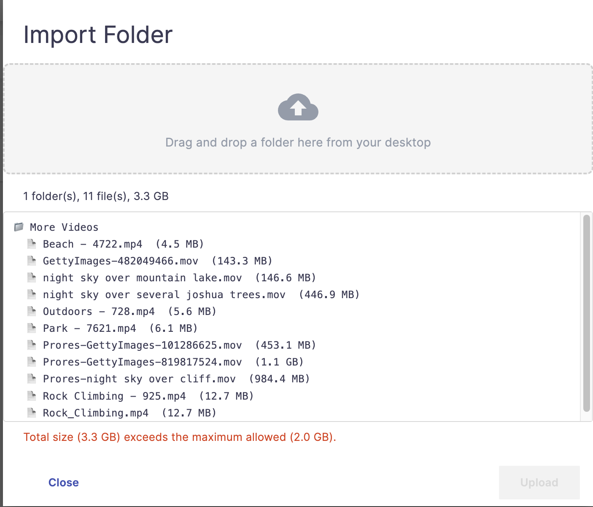
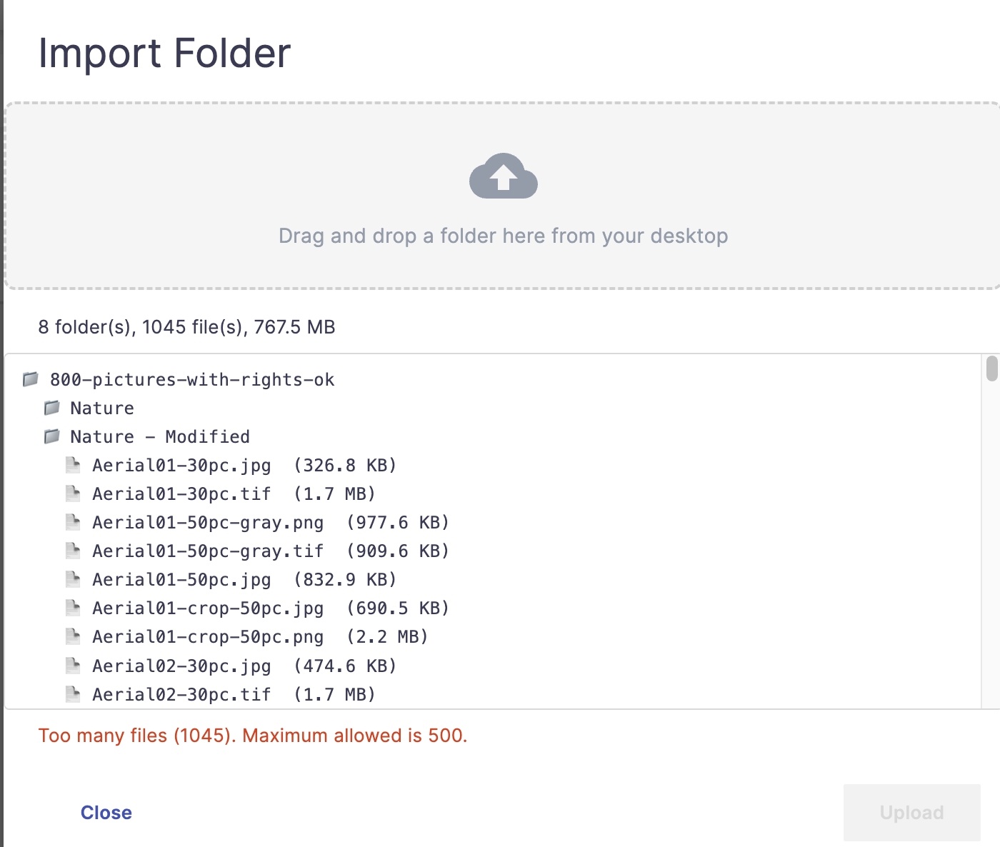

# nuxeo-labs-folder-drop

## TL;DR

Drag-and-drop folder import for Nuxeo Web UI (LTS 2025). Drop folders from your desktop onto any Folderish document to create the full hierarchy in Nuxeo. Supports S3 direct upload, configurable file filtering, custom document type resolution via callback chain, and a server-side event on completion.

> [!NOTE]
> This is Work In Progress - Not ready for use

> [!IMPORTANT]
> This plugin is not for mass import. See [Scope and Use Cases](#scope-and-use-cases).

## Description

A Nuxeo LTS 2025 plugin that adds **drag-and-drop folder import** to [Nuxeo Web UI](https://doc.nuxeo.com/nxdoc/web-ui/), preserving the folder hierarchy. Users can drop one or more folders from their desktop (Mac, Windows) and the plugin creates the corresponding Nuxeo documents — folders and files — mirroring the original structure.

The plugin adds a **"Drop Folder..."** button on every Folderish document in Nuxeo Web UI (Workspace, Folder, etc.). Clicking it opens a dialog where folders can be dragged and dropped from the desktop.

## Usage

### 1. Open the Drop Folder Dialog

Navigate to any Folderish document (Workspace, Folder, etc.) and click the **folder icon** button in the document actions toolbar.

### 2. Drop Folders

Drag one or more folders from your desktop into the drop zone...



...the plugin reads the full tree recursively and displays:

- A **tree preview** showing the folder/file hierarchy
- A **summary** with the number of folders, files, and total size (e.g., "3 folder(s), 12 file(s), 45.2 MB")



### 3. Upload

Click **Upload** to start the import. The dialog shows progress through each phase:

1. **Uploading files** — Files are uploaded to a batch on the server, with a progress bar showing the count (e.g., "Uploading files... (5/12)"). The name and size of the file currently being uploaded are displayed below the progress bar. For large files (> 10 MB), an additional animated progress bar indicates the upload is still in progress.
2. **Resolving document types** — If a callback chain is configured (see [Callback Chain](#callback-chain) below), an indeterminate progress bar is shown while the server resolves document types
3. **Creating documents** — Folders and files are created in Nuxeo, with a combined progress bar (e.g., "Creating documents... (8/15)")

Each completed phase shows a checkmark.



### 4. Done

Once the import completes, a success message is displayed. Clicking **Close** refreshes the current view to show the newly imported documents.



### 5. Guardrails

See below: The plugin has configurable guardrails (number of files, total size). If the dropped element(s) reach one of these, the upload cannot be done and a message states the reason:






### S3 Direct Upload

When the [Nuxeo S3 Direct Upload](https://doc.nuxeo.com/nxdoc/amazon-s3-direct-upload/) addon is installed and configured (`s3.useDirectUpload=true`), the plugin provides an alternative element optimized for S3:

- **Parallel uploads** — Files upload simultaneously directly to S3, bypassing the Nuxeo server for the actual data transfer
- **Real progress tracking** — An aggregate bytes-based progress bar (e.g., "Uploading files... (12.5 MB / 45.2 MB)") replaces the file-count progress bar
- **Per-file progress** — A scrollable list below the aggregate bar shows each in-flight file with its own percentage progress bar

#### Enabling the S3 Element

The plugin ships two upload elements. By default, the standard element (`nuxeo-labs-folder-drop`) is active. To switch to the S3-optimized element (`nuxeo-labs-folder-drop-s3`), override the slot contribution in your Nuxeo Studio project (in Designer, in the custom bundle):

```html
<nuxeo-slot-content name="folderDropAction" slot="DOCUMENT_ACTIONS" order="40">
  <template>
    <nuxeo-filter document="[[document]]" facet="Folderish">
      <template>
        <nuxeo-labs-folder-drop-s3 document="[[document]]" display></nuxeo-labs-folder-drop-s3>
      </template>
    </nuxeo-filter>
  </template>
</nuxeo-slot-content>
```

> [!IMPORTANT]
> The `display` attribute **must** be present on the element you want active, and **absent** on the one you want hidden. Never use `display="false"` — in Polymer 2, attribute presence = true, absence = false.

### Duplicate Handling

After dropping items and before uploading, the plugin checks whether any of the **top-level** dropped items (folders or files) have the same title as existing children of the target document. If duplicates are found, an **informational warning** is displayed listing the matching names — for example:

> *The following item(s) already exist at this location: Reports, data.csv. New documents will be created with the same title, which may appear as duplicates.*

This is a **warning only** — the Upload button remains enabled and the user can choose to proceed. Nuxeo allows multiple documents with the same `dc:title` under the same parent; it creates a unique internal name (used in the URL path) for each new document. In the UI, the user will see what appears to be duplicate entries with the same title.

Note: Only top-level items are checked. Sub-items (files and folders inside dropped folders) are created inside newly created folders, so there is no conflict with existing documents.

## Customization

### Overriding the Element

The `nuxeo-labs-folder-drop.html` element can be overridden by placing a modified copy at the same path in your Nuxeo Studio project's custom bundle: `ui/nuxeo-labs-folder-drop/nuxeo-labs-folder-drop.html`. However, given the size and complexity of the element (~1,500 lines), this is **not recommended** unless you have a specific need and are comfortable maintaining your own fork.

### Customizing the Action Button

What is easy and recommended is to customize the **slot contribution** that controls where and when the button appears. Copy the default contribution:

```html
<nuxeo-slot-content name="folderDropAction" slot="DOCUMENT_ACTIONS" order="40">
  <template>
    <nuxeo-filter document="[[document]]" facet="Folderish">
      <template>
        <nuxeo-labs-folder-drop document="[[document]]" display></nuxeo-labs-folder-drop>
      </template>
    </nuxeo-filter>
  </template>
</nuxeo-slot-content>
```

Paste it into your Studio project's custom bundle and adjust it to your needs.

> [!IMPORTANT]
> Do not change the `name="folderDropAction"` attribute. Nuxeo's slot system merges contributions by name — using the same name ensures your contribution **overrides** the default one. If you use a different name, both contributions will be active and the button will appear twice.

**Examples:**

Make the button appear first in the toolbar — change `order="40"` to `order="1"`:

```html
<nuxeo-slot-content name="folderDropAction" slot="DOCUMENT_ACTIONS" order="1">
```

Restrict to specific document types — replace the `facet` filter with a `type` filter:

```html
<nuxeo-filter document="[[document]]" type="SpecialFolder,SuperContainerDoc">
```

Restrict by permission — add a permission filter:

```html
<nuxeo-filter document="[[document]]" facet="Folderish" permission="Write">
```

You can combine multiple filters as needed. See the [Nuxeo Web UI Slots documentation](https://doc.nuxeo.com/nxdoc/web-ui-slots/) for all available filter options.

## Configuration

The plugin enforces limits on the number of files and total size that can be uploaded in a single drop. These limits can be tuned in `nuxeo.conf` to match your deployment constraints (network speed, server capacity, Nuxeo cluster setup, etc.):

| Property | Default | Description |
|---|---|---|
| `org.nuxeo.web.ui.folderDrop.maxFiles` | `500` | Maximum number of files allowed per drop |
| `org.nuxeo.web.ui.folderDrop.maxTotalSizeInBytes` | `2147483648` (2 GB) | Maximum total size in bytes allowed per drop |
| `org.nuxeo.web.ui.folderDrop.filterHiddenFiles` | `true` | Filter files/folders whose name starts with `.` (e.g., `.DS_Store`, `.git`) |
| `org.nuxeo.web.ui.folderDrop.mimeTypeDenyPatterns` | *(empty)* | Comma-separated list of regex patterns to deny files by MIME type |

Example `nuxeo.conf`:

```
org.nuxeo.web.ui.folderDrop.maxFiles=1000
org.nuxeo.web.ui.folderDrop.maxTotalSizeInBytes=5368709120
org.nuxeo.web.ui.folderDrop.filterHiddenFiles=true
org.nuxeo.web.ui.folderDrop.mimeTypeDenyPatterns=video/.*,application/x-executable
```

These properties can also be overridden via an XML contribution to `org.nuxeo.runtime.ConfigurationService`.

## Scope and Use Cases

This plugin is designed for **end-user convenience**, not for bulk or mass import. For large-scale data migration or automated ingestion, refer to the Nuxeo documentation on [choosing how to import data](https://doc.nuxeo.com/nxdoc/choosing-how-to-import-data-in-the-nuxeo-platform/).

The typical use case is a user dropping a folder containing some dozens of files, with or without a folder hierarchy. The plugin implements guardrails to prevent overloading the server — see [Configuration](#configuration) for the maximum file count and total size settings.

When users upload large files (more than a few dozen MB each), Nuxeo timeout configuration parameters may need to be tuned (e.g., transaction timeout, reverse proxy timeouts) to avoid interruptions during the upload or document creation phases.

## Default Behavior

Without any additional configuration:

- **Folders** are created as `Folder` document type
- **Files** are imported using the Nuxeo `FileManager.Import` operation, which auto-detects the document type from the MIME type (e.g., a `.pdf` becomes a `File`, a `.png` becomes a `Picture`, etc.)

## File Filtering

The plugin supports two types of file filtering to control which files are accepted during import.

### Hidden Files

By default, files and folders whose name starts with `.` are filtered out (e.g., `.DS_Store`, `.git`, `.thumbs`). On macOS and Windows, hidden files start with `.`. This behavior is controlled by `org.nuxeo.web.ui.folderDrop.filterHiddenFiles` (default: `true`).

### MIME Type Deny Patterns

You can configure a comma-separated list of **regex patterns** to deny files by MIME type. Each pattern is a standard Java/JavaScript regular expression matched against the full MIME type string.

Examples:

| Pattern | Effect |
|---|---|
| `video/.*` | Deny all video files |
| `application/x-executable` | Deny executable files (exact match) |
| `application/x-msdownload` | Deny Windows executables |
| `video/.*,application/x-executable` | Deny videos and executables |
| `.*\/.*` | Deny all files (not recommended) |

### Enforcement

Filtering is enforced at **two levels**:

1. **Client-side**: Files matching deny patterns or hidden file rules are silently excluded during the folder scan, before upload. They do not appear in the tree preview and are not uploaded.
2. **Server-side**: The server validates all received items against the same rules. If any denied file reaches the server (which should not happen unless the client was tampered with), the entire import is **rejected** with an explicit error message.

### XML Configuration

The filtering settings can also be configured via XML contribution, which supports `nuxeo.conf` variable substitution:

```xml
<extension target="nuxeo.labs.folderdrop.FolderDropService" point="configuration">
  <configuration>
    <mimeTypeDenyPatterns>${org.nuxeo.web.ui.folderDrop.mimeTypeDenyPatterns:=}</mimeTypeDenyPatterns>
    <filterHiddenFiles>${org.nuxeo.web.ui.folderDrop.filterHiddenFiles:=true}</filterHiddenFiles>
  </configuration>
</extension>
```

## Callback Chain

The plugin supports an optional **callback automation chain** that allows you to customize the document type created for each item (folder or file) in the tree.

### Configuration

Contribute an XML extension to set the callback chain:

```xml
<extension target="nuxeo.labs.folderdrop.FolderDropService" point="configuration">
  <configuration>
    <callbackChain>myCallbackChain</callbackChain>
  </configuration>
</extension>
```

> [!IMPORTANT]
> Remember JS Automation script are prefixed with `javascript.`:
> ```xml
> <extension target="nuxeo.labs.folderdrop.FolderDropService" point="configuration">
>   <configuration>
>     <callbackChain>javascript.myJSCallbackChain</callbackChain>
>   </configuration>
> </extension>
> ```


### Chain Syntax

The callback chain is called **once per item** in the tree. It receives:

| | Type | Description |
|---|------|-------------|
| **Input** | `document` | The parent container document |
| **`name`** | `String` | Name of the item (e.g., `"report.pdf"`) |
| **`is_folder`** | `boolean` | `true` if the item is a folder |
| **`mime_type`** | `String` | MIME type of the file (empty string for folders) |
| **`size`** | `long` | File size in bytes (0 for folders) |
| **`relative_path`** | `String` | Relative path within the dropped tree (e.g., `"folder1/subfolder/report.pdf"`) |

The chain **must set** the context variable `FolderDrop_Result` to a JSON string:

```json
{"docType": "MyCustomType"}
```

### Example Chain (Automation Scripting)

> [!IMPORTANT]
> When using JavaScript Automation, parameters **must be explicitly declared** in the chain definition (in Studio or XML). If they are not declared, `params.name`, `params.is_folder`, etc. will be `undefined`.

```javascript
// input is the main parent (where the user is currently drag-dropping)
function run(input, params) {
  var result = {};
  var isDroppingInCustomDocType = input.type === "MyCustomWorkspace";
  var mime = params.mime_type || "";
  var isImage = mime.indexOf("image/") === 0;

  if (params.is_folder) {
    if(isDroppingInCustomDocType) {
      result.docType = "MyCustomFolder";
    } else {
      result.docType = "Workspace";
    }
  } else {
    
    if(isDroppingInCustomDocType) {
      if (isImage) {
        result.docType = "MyCustomPictureDoc";
      } else {
        result.docType = "MyCustomFileDoc";
      }
    } else {
      if (isImage) {
        result.docType = "Picture";
      } else {
        result.docType = "File";
      }
    }
  }

  ctx.FolderDrop_Result = JSON.stringify(result);
  return input;
}
```

### Behavior With Callback Chain

When a callback chain is configured, **all documents are created explicitly** with the resolved types:

- Folders are created with the type returned by the chain (instead of the default `Folder`)
- Files are created with the type returned by the chain, with the blob attached to `file:content` (instead of using `FileManager.Import`)

If the chain does not set `FolderDrop_Result` for a specific item, the default applies: `Folder` for folders, `FileManager.Import` for files.

## Server-Side API

### Automation Operation: `FolderDrop.ResolveTypes`

> [!NOTE]
> This operation is used internally by the plugin, you llikely don't need to call it explicitly. It is documented for transparency.
> Of course, it is possible to override it if you want to change the behavior: Just write an operation with the exact same ID (`FolderDrop.ResolveTypes`), and make sure to have the same behabior.

| | |
|---|---|
| **ID** | `FolderDrop.ResolveTypes` |
| **Input** | None |
| **Parameters** | `parentPath` (String, required) — path of the parent container |
| | `treeJson` (String, required) — JSON array describing the tree |
| **Output** | `Blob` — same JSON array with `docType` populated |

### Extension Point: `configuration`

| Target | `nuxeo.labs.folderdrop.FolderDropService` |
|--------|------------------------------------------|
| Point | `configuration` |
| Descriptor | `<callbackChain>chainId</callbackChain>` |
| | `<mimeTypeDenyPatterns>regex1,regex2</mimeTypeDenyPatterns>` |
| | `<filterHiddenFiles>true\|false</filterHiddenFiles>` |

### Automation Operation: `FolderDrop.NotifyDone`

> [!NOTE]
> This operation is called internally by the plugin after all documents have been created (or after a failure). It is documented here for transparency and to describe the event it fires.

| | |
|---|---|
| **ID** | `FolderDrop.NotifyDone` |
| **Input** | None |
| **Parameters** | `parentId` (String, required) — UUID of the target parent document |
| | `status` (String, required) — `"success"`, `"partial"`, or `"failure"` |
| | `droppedFolderCount` (int, required) — number of folders in the dropped tree |
| | `droppedFileCount` (int, required) — number of files in the dropped tree |
| | `createdCount` (int, required) — number of documents actually created |
| | `failedItem` (String, optional) — relative path of the item that failed |
| | `failedMessage` (String, optional) — server error message |
| **Output** | void |

This operation fires the `folderDropImportDone` event (see below).

### Event: `folderDropImportDone`

After a folder drop import completes — whether successfully or with an error — the plugin fires a `folderDropImportDone` event. This is a `DocumentEventContext` on the parent document, with the following context properties:

| Property | Type | Description |
|----------|------|-------------|
| `status` | String | `"success"` — all items created; `"partial"` — some items created before failure; `"failure"` — no items created |
| `parentId` | String | UUID of the target parent document |
| `droppedFolderCount` | int | Number of folders in the dropped tree |
| `droppedFileCount` | int | Number of files in the dropped tree |
| `createdCount` | int | Number of documents actually created (folders + files) |
| `failedItem` | String | Relative path of the item that caused the failure (null on success) |
| `failedMessage` | String | Server error message (null on success) |

> [!IMPORTANT]
> Listeners for this event should be registered with `async="true"`. A synchronous listener would block the `FolderDrop.NotifyDone` operation and the client until it completes, degrading the user experience.

**Example listener registration:**

```xml
<extension target="org.nuxeo.ecm.core.event.EventServiceComponent" point="listener">
  <listener name="myFolderDropListener"
            class="com.example.MyFolderDropListener"
            async="true">
    <event>folderDropImportDone</event>
  </listener>
</extension>
```

The event name is also available as the constant `FolderDropService.EVENT_IMPORT_DONE` for use in Java code.

## How to Build and Deploy

### Build and Deploy Locally

```bash
git clone https://github.com/nuxeo-sandbox/nuxeo-labs-folder-drop
cd nuxeo-labs-folder-drop
mvn clean install
```

To skip unit testing, add `-DskipTests`.

The Marketplace package is generated at:
```
nuxeo-labs-folder-drop-package/target/nuxeo-labs-folder-drop-package-*.zip
```

Install it via `nuxeoctl`:
```bash
nuxeoctl mp-install nuxeo-labs-folder-drop-package-2025.1.0-SNAPSHOT.zip
```

### Deploy from Nuxeo Marketplace

This plugin will be available as a package on the [Nuxeo Marketplace](https://connect.nuxeo.com/nuxeo/site/marketplace), you can just:
```bash
nuxeoctl mp-install nuxeo-labs-folder-drop
```


## Support

**These features are not part of the Nuxeo Production platform.**

These solutions are provided for inspiration and we encourage customers to use them as code samples and learning resources.

This is a moving project (no API maintenance, no deprecation process, etc.) If any of these solutions are found to be useful for the Nuxeo Platform in general, they will be integrated directly into the platform, not maintained here.

## License

[Apache License, Version 2.0](http://www.apache.org/licenses/LICENSE-2.0.html)

## About Nuxeo

Nuxeo Platform is an open source highly scalable, cloud-native, enterprise content management product with rich multimedia support, written in Java. Data can be stored in both SQL & NoSQL databases.

The development of the Nuxeo Platform is mostly done by Nuxeo employees with an open development model.

The source code, documentation, roadmap, issue tracker, testing, benchmarks are all public.

More information is available at [Hyland/Nuxeo](https://www.hyland.com/en/solutions/products/nuxeo-platform).
